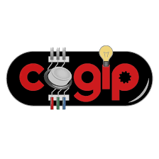
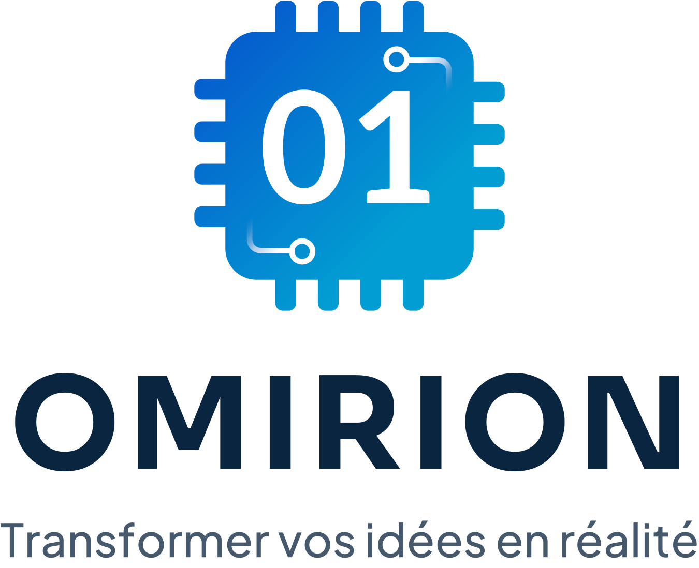
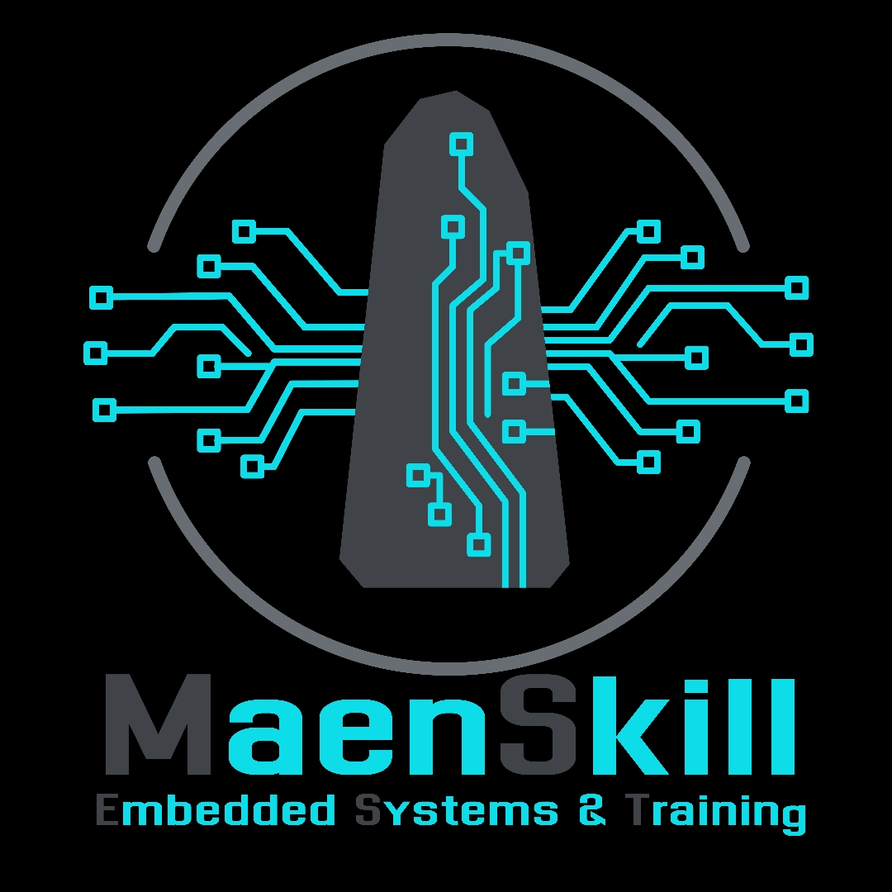

<!-- _class: lead -->



# A real robot firmware on **RIOT-OS**

From a custom STM32 board to over-the-network updates:
everything we ship on RIOT.

**RIOT Summit 2026**

Gilles DOFFE & Mathis LECRIVAIN

<!--
Presenter: Gilles DOFFE & Mathis LECRIVAIN.
Each introduces themselves and their company in one sentence.

Mathis: embedded software engineer at Rtone, specialised in real-time systems.
Robotics enthusiast, competing in the Coupe de France de Robotique since 2015.
-->

---

## Who we are

- **COGIP**, a robotics association competing in the **Coupe de France de
  Robotique** (Eurobot).
- A **team of 5**, building the whole robots: mechanics, electronics, firmwares, host.
- **6 robots** running together on the table: 1 main robot, 4 SIMAs and 1 "Ninja"
- Robots that must **localize, plan and move** autonomously on a table, in 100s.
- Every MCUs on robots runs **RIOT-OS** and is developed in **C++20**.

> This talk is **not** a deep dive into one feature, but a **map** of what RIOT lets
> a small team build end to end, focusing on the main robot.

<!--
Presenter: Gilles DOFFE.
-->

---

## The playing area

<div class="fig">
<svg viewBox="0 0 1000 425" xmlns="http://www.w3.org/2000/svg" font-family="arial, helvetica, sans-serif">
  <image href="cogip-table.png" x="250" y="150" width="500" height="214"/>
  <!-- leader lines to the real zones -->
  <g stroke="#b23c37" stroke-width="1" fill="none">
    <line x1="70"  y1="30"  x2="337" y2="183"/>
    <line x1="250" y1="30"  x2="452" y2="180"/>
    <line x1="458" y1="30"  x2="495" y2="190"/>
    <line x1="655" y1="30"  x2="569" y2="170"/>
    <line x1="872" y1="30"  x2="610" y2="180"/>
    <line x1="120" y1="400" x2="400" y2="257"/>
    <line x1="372" y1="400" x2="458" y2="257"/>
    <line x1="628" y1="400" x2="565" y2="330"/>
    <line x1="858" y1="400" x2="721" y2="334"/>
  </g>
  <g fill="#b23c37">
    <circle cx="337" cy="183" r="3.5"/>
    <circle cx="452" cy="180" r="3.5"/>
    <circle cx="495" cy="190" r="3.5"/>
    <circle cx="569" cy="170" r="3.5"/>
    <circle cx="610" cy="180" r="3.5"/>
    <circle cx="400" cy="257" r="3.5"/>
    <circle cx="458" cy="257" r="3.5"/>
    <circle cx="565" cy="330" r="3.5"/>
    <circle cx="721" cy="334" r="3.5"/>
  </g>
  <!-- zone labels (same set as the official overview) -->
  <g font-size="13.5" font-weight="bold" text-anchor="middle" fill="#b23c37">
    <text x="70"  y="24">Nest</text>
    <text x="250" y="24">Fridge (x4)</text>
    <text x="458" y="24">Granary</text>
    <text x="655" y="24">Ninja starting area</text>
    <text x="872" y="24">Loading area</text>
    <text x="120" y="416">Pantry (x10)</text>
    <text x="372" y="416">Collection area (x10)</text>
    <text x="628" y="416">Thermometer</text>
    <text x="858" y="416">Cursor</text>
  </g>
</svg>
</div>

Set cursor, grab, sort and put down crates in given areas while avoiding the opponent, all in **100 s** with **no operator**.

<!--
Presenters: Gilles DOFFE & Mathis LECRIVAIN.
Gilles: briefly the rules and the game actions.
Mathis: the robots and where they go on the table.

Mathis: six robots. The big one doing the main actions. One medium one
working a dedicated zone. Four small ones playing the last 15 seconds. Same constraints for all of them: accurate motion control, and avoid the opponent.
-->

---

<!-- _class: small -->

## The software stack

- **cogip-tools**: Python/C++ host on the Raspberry Pi. Planner, copilot, avoidance, dashboard, tools, Protobuf python bindings.
  - `github.com/cogip/cogip-tools`
- **mcu-firmware**: C++ firmware for the STM32 boards. Motion, actuators, sensors, EMS, logs.
  - `github.com/cogip/mcu-firmware`
- **RIOT (our fork)**: the RTOS the firmware runs on. Branch `cogip_master`, board and CPU additions, packages versions updates.
  - `github.com/cogip/RIOT`

<!--
Presenter: Gilles DOFFE.
-->

---

## The big picture

<div class="fig">
<svg viewBox="0 0 1000 320" xmlns="http://www.w3.org/2000/svg" font-family="arial, helvetica, sans-serif">
  <!-- connectors (board -> bus) -->
  <g stroke="#8a8a90" stroke-width="2">
    <line x1="118" y1="100" x2="118" y2="250"/>
    <line x1="309" y1="100" x2="309" y2="250"/>
    <line x1="500" y1="100" x2="500" y2="250"/>
    <line x1="691" y1="100" x2="691" y2="250"/>
    <line x1="882" y1="100" x2="882" y2="250"/>
  </g>
  <!-- board boxes -->
  <g fill="#ffffff" stroke="#b23c37" stroke-width="1.5">
    <rect x="30"  y="30" width="176" height="70" rx="6"/>
    <rect x="221" y="30" width="176" height="70" rx="6"/>
    <rect x="412" y="30" width="176" height="70" rx="6"/>
    <rect x="603" y="30" width="176" height="70" rx="6"/>
    <rect x="794" y="30" width="176" height="70" rx="6"/>
  </g>
  <g fill="#1b1b1f" font-size="14" text-anchor="middle">
    <text x="118" y="60">Raspberry Pi 4</text><text x="118" y="80" font-size="12" fill="#63636a">host (Python)</text>
    <text x="309" y="60">Motion control</text><text x="309" y="80" font-size="12" fill="#63636a">2 motors</text>
    <text x="500" y="60">Lift 1</text><text x="500" y="80" font-size="10.5" fill="#63636a">motor + limit switches</text>
    <text x="691" y="60">Lift 2</text><text x="691" y="80" font-size="10.5" fill="#63636a">motor + limit switches</text>
    <text x="882" y="65">Power supply</text>
  </g>
  <!-- CAN bus backplane -->
  <rect x="20" y="250" width="960" height="52" rx="6" fill="#b23c37" stroke="#7a2723"/>
  <polygon points="34,276 52,266 52,286" fill="#fff"/>
  <polygon points="966,276 948,266 948,286" fill="#fff"/>
  <text x="500" y="281" fill="#fff" font-size="17" font-weight="bold" text-anchor="middle">CAN bus &#183; Protobuf messages</text>
</svg>
</div>

**4 STM32 boards + 1 Pi 4**, all CAN nodes speaking **Protobuf**. Same "motors"
board runs three roles (motion + two lifts) on one HW, configured at build time.

<!--
Presenter: Gilles DOFFE.
-->

---

## Three targets, one codebase

<div class="mermaid">
graph TB
  SRC["mcu-firmware<br/>(one C++ source tree)"]
  SRC --> B1["cogip-board<br/>STM32G4"]
  SRC --> B2["cogip-board-h5<br/>STM32H5"]
  SRC --> B3["cogip-native<br/>PC simulation"]
  B1 --> HW1["real robot (G4)"]
  B2 --> HW2["real robot (H5)"]
  B3 --> HW3["laptop / CI"]
</div>

Same controllers, same Protobuf, three back-ends. **`make BOARD=...`** and go. On
`cogip-native`, **docker compose** spins up the full stack (firmware + host +
virtual CAN), no hardware.

<!--
Presenters: Gilles DOFFE & Mathis LECRIVAIN.
Gilles: the cogip-board targets. Mathis: cogip-native, bridging to the next slide.

Mathis: native is not a demo target, it is part of the product and we use it
every day. Same firmware on a host, and it must behave identically. One docker
compose stack = native firmware + all the host tools, so we test strategy and
game logic with no hardware: work remotely without the robot, develop faster,
catch bugs before power-up. Happy to demo it off-stage.
-->

---

## Native simulation

<div class="mermaid">
graph TB
  FW["firmware (same C++)"]
  FW --> SC["libsocketcan<br/>(real virtual CAN)"]
  FW --> GP["periph_gpio_mock"]
  FW --> MTD["emulated MTD<br/>(FlashDB in RAM)"]
  SC --> HOST["Linux vcan0"]
</div>

`cogip-native` compiles the firmware **as a PC binary**. Real CAN frames on a
virtual bus, mocked GPIO, emulated flash. Dev and **CI** with **zero hardware**.

<!--
Presenter: Mathis LECRIVAIN.

So how does it work? Peripherals are not stubbed, apart from a few IOs. CAN runs
for real, on the host's virtual CAN bus, so the whole robot communication
architecture behaves as on the real thing. Parameters work too, FlashDB backed
by RAM. The firmware behaves identically, just in a perfect world: no physical
disturbance on the motion control.
-->

---

## Why we moved to the H5

<div class="fig">
<svg viewBox="0 0 1000 244" xmlns="http://www.w3.org/2000/svg" font-family="arial, helvetica, sans-serif">
  <!-- five taller cards: past (white), today H5 (red), target (dashed) -->
  <g fill="#ffffff" stroke="#b23c37" stroke-width="1.5">
    <rect x="12"  y="14" width="185" height="158" rx="6"/>
    <rect x="210" y="14" width="185" height="158" rx="6"/>
    <rect x="408" y="14" width="185" height="158" rx="6"/>
  </g>
  <rect x="606" y="14" width="185" height="158" rx="6" fill="#b23c37" stroke="#7a2723" stroke-width="1.5"/>
  <rect x="804" y="14" width="185" height="158" rx="6" fill="#ffffff" fill-opacity="0.55"
        stroke="#b23c37" stroke-width="1.5" stroke-dasharray="6 4"/>
  <!-- titles -->
  <g font-size="15" font-weight="bold" text-anchor="middle">
    <text x="105" y="38" fill="#1b1b1f">G4 + RIOT</text>
    <text x="302" y="38" fill="#1b1b1f">New features</text>
    <text x="500" y="38" fill="#1b1b1f">One bus for all</text>
    <text x="698" y="38" fill="#ffffff">STM32H5</text>
    <text x="896" y="38" fill="#b23c37">All-Ethernet</text>
  </g>
  <g stroke-width="1">
    <line x1="30"  y1="48" x2="179" y2="48" stroke="#efd6d4"/>
    <line x1="228" y1="48" x2="377" y2="48" stroke="#efd6d4"/>
    <line x1="426" y1="48" x2="575" y2="48" stroke="#efd6d4"/>
    <line x1="624" y1="48" x2="773" y2="48" stroke="#d98b86"/>
    <line x1="822" y1="48" x2="971" y2="48" stroke="#efd6d4"/>
  </g>
  <!-- bullet at the start of each idea -->
  <g fill="#b23c37">
    <circle cx="26"  cy="66" r="3"/><circle cx="26"  cy="126" r="3"/>
    <circle cx="224" cy="66" r="3"/><circle cx="224" cy="126" r="3"/>
    <circle cx="422" cy="66" r="3"/>
    <circle cx="818" cy="66" r="3"/>
  </g>
  <g fill="#ffffff">
    <circle cx="620" cy="66" r="3"/>
  </g>
  <!-- bullet text, left-aligned, full readable phrases -->
  <g font-size="11" fill="#1b1b1f">
    <text x="36"  y="70">motion control</text>
    <text x="36"  y="100">actuators on CAN FD</text>
    <text x="36"  y="130">years of competition</text>
    <text x="234" y="70">syslog + telemetry</text>
    <text x="234" y="100">firmware + sysmon</text>
    <text x="234" y="130">it all needs the bus</text>
    <text x="432" y="70">G4: no Ethernet MAC</text>
    <text x="432" y="100">logs, streams, images</text>
    <text x="432" y="130">fight the control loop</text>
  </g>
  <g font-size="11" fill="#ffffff">
    <text x="630" y="70">Ethernet, dual-bank</text>
    <text x="630" y="100">in our RIOT fork</text>
    <text x="630" y="130">app code untouched</text>
  </g>
  <g font-size="11" fill="#5f5f66">
    <text x="828" y="70">control traffic too</text>
    <text x="828" y="100">CAN retires one</text>
    <text x="828" y="130">subsystem at a time</text>
  </g>
  <!-- timeline under the cards (Mathis's layout) -->
  <line x1="15" y1="205" x2="975" y2="205" stroke="#b23c37" stroke-width="3"/>
  <polygon points="985,205 967,196 967,214" fill="#b23c37"/>
  <g stroke="#8a8a90" stroke-width="2">
    <line x1="105" y1="172" x2="105" y2="198"/>
    <line x1="302" y1="172" x2="302" y2="198"/>
    <line x1="500" y1="172" x2="500" y2="198"/>
    <line x1="698" y1="172" x2="698" y2="198"/>
  </g>
  <line x1="896" y1="172" x2="896" y2="198" stroke="#b23c37" stroke-width="2" stroke-dasharray="5 4"/>
  <g fill="#ffffff" stroke="#b23c37" stroke-width="2.5">
    <circle cx="105" cy="205" r="7"/>
    <circle cx="302" cy="205" r="7"/>
    <circle cx="500" cy="205" r="7"/>
  </g>
  <circle cx="698" cy="205" r="7" fill="#b23c37" stroke="#7a2723" stroke-width="2.5"/>
  <circle cx="896" cy="205" r="7" fill="#e9e9ea" stroke="#b23c37" stroke-width="2" stroke-dasharray="4 3"/>
  <g font-size="12.5" text-anchor="middle" fill="#63636a">
    <text x="105" y="230">where we were</text>
    <text x="302" y="230">what we wanted</text>
    <text x="500" y="230">the ceiling</text>
    <text x="698" y="230">where we are</text>
  </g>
  <text x="896" y="230" font-size="12.5" text-anchor="middle" fill="#b23c37">where we are going</text>
</svg>
</div>

**Today** CAN FD carries the control loop and Ethernet takes the new features:
logs, telemetry, firmware images. We move **one subsystem at a time**.

<!--
Presenters: Gilles DOFFE & Mathis LECRIVAIN.
Ping-pong across the boxes: Gilles takes the first box, Mathis the next, alternating.

Mathis, "New features": when I joined the team we started building proper
diagnostic tools, essential to get a robot well tuned. Telemetry, real-time log
streaming. All of it wants the bus, next to the control loop. (Hand over to
Gilles for the ceiling.)

Mathis, "STM32H5": this year's new board. We redid the G4 board with Ethernet
added and CAN kept (show both small PCBs). That unlocks everything listed here.

Background: the honest trigger was not raw bandwidth but the missing MAC. On the
G4 every new feature had to be squeezed onto the bus already carrying the control
loop, so each one made the loop worse. The H5 gave us a second pipe. We are not
keeping CAN out of conviction: it is the migration path. Everything ported to
Ethernet stays there, and the bus shrinks release after release until only the
control loop is left, then that moves too.
-->

---

<!-- _class: small -->

## Adding the STM32H5

Brand-new **CPU family** bring-up in our RIOT fork.

<div class="cols">
<div>

**Working now**

- CAN (FDCAN)
- Ethernet
- PWM · QDEC
- UART · GPIO · Timer
- riotboot (dual-bank flash)

</div>
<div>

**What we wrote**

- a new **CPU family** in our RIOT fork
- one **thin board** layer, just three files
- RAM-function flash erase (read-while-write)

</div>
</div>

> Two boards, two CPU families, **one application tree**, and nothing in the
> port is COGIP-specific, which is why it is worth **upstreaming**.

*Full disclosure: the code is written by Claude. We just do the thinking (a bit).*

<!--
Presenter: Gilles DOFFE.
-->

---

## Protobuf on the MCU

- **EmbeddedProto**: Protobuf on a microcontroller.
- Our **own RIOT-style package**, not upstream: `USEPKG += embedded-proto`.
- RIOT's **pkg system is extensible**: external package builds like a built-in, no fork.
- `protoc` runs **at build** and emits **C++ with no heap** (like ETL).
- **Same `.proto`** also generates the **Python** host bindings.

<!--
Presenter: Gilles DOFFE.
-->

---

## ETL, the STL without a heap

- Embedded Template Library: containers with **no dynamic allocation**.
- `etl::variant`, `etl::unordered_map`, `etl::string<N>` (bounded, deterministic).
- Example: **`ControllersIO`**, a typed key-value store passed down the control chain.

```cpp
// value is etl::variant<float, double, int, bool, etl::string<32>>
io.set("linear_pose_error", err);
auto s = io.get_as<float>("linear_current_speed"); // etl::optional<float>
```

We never call `malloc`. Memory use is fixed at build time.

<!--
Presenter: Gilles DOFFE.
-->

---

## Motion control, the cycle

<div class="mermaid">
sequenceDiagram
  participant S as Sensors
  participant E as PlatformEngine
  participant C as Controller chain
  participant M as Motors
  loop every fixed cycle
    S->>E: prepare_inputs()<br/>(pose, speed, target)
    E->>C: execute() runs the chain on ControllersIO
    C->>E: speed / angular commands
    E->>M: process_outputs()
  end
</div>

The loop runs at a fixed period. As long as it runs, the firmware is **healthy**.
The watchdog checks exactly this (later).

<!--
Presenter: Mathis LECRIVAIN.

With everything described so far, the goal is one thing: a motion control loop
accurate enough for smooth moves. Encoder-derived data plus a target go into the
controller chain Gilles just described; out comes a duty cycle, straight to the
motors. The strength of this design: any controller can be dropped into the
chain, polar navigation, natural navigation, whatever we need.
-->

---

## 100 seconds, 5,000 cycles

<div class="fig">
<svg viewBox="0 0 1000 300" xmlns="http://www.w3.org/2000/svg" font-family="arial, helvetica, sans-serif">
  <text x="40" y="46" font-size="14" font-weight="bold" fill="#1b1b1f">one match: fully autonomous, no operator, no retry</text>
  <!-- the match, combed into control cycles (illustrative comb, 5000 won't draw) -->
  <rect x="40" y="60" width="920" height="72" rx="6" fill="#ffffff" stroke="#b23c37" stroke-width="1.5"/>
  <g stroke="#e3c6c4" stroke-width="0.9">
    <line x1="55" y1="60" x2="55" y2="132"/><line x1="70" y1="60" x2="70" y2="132"/>
    <line x1="85" y1="60" x2="85" y2="132"/><line x1="100" y1="60" x2="100" y2="132"/>
    <line x1="115" y1="60" x2="115" y2="132"/><line x1="130" y1="60" x2="130" y2="132"/>
    <line x1="145" y1="60" x2="145" y2="132"/><line x1="160" y1="60" x2="160" y2="132"/>
    <line x1="175" y1="60" x2="175" y2="132"/><line x1="190" y1="60" x2="190" y2="132"/>
    <line x1="205" y1="60" x2="205" y2="132"/><line x1="220" y1="60" x2="220" y2="132"/>
    <line x1="235" y1="60" x2="235" y2="132"/><line x1="250" y1="60" x2="250" y2="132"/>
    <line x1="265" y1="60" x2="265" y2="132"/><line x1="280" y1="60" x2="280" y2="132"/>
    <line x1="295" y1="60" x2="295" y2="132"/><line x1="310" y1="60" x2="310" y2="132"/>
    <line x1="325" y1="60" x2="325" y2="132"/><line x1="340" y1="60" x2="340" y2="132"/>
    <line x1="355" y1="60" x2="355" y2="132"/><line x1="370" y1="60" x2="370" y2="132"/>
    <line x1="385" y1="60" x2="385" y2="132"/><line x1="400" y1="60" x2="400" y2="132"/>
    <line x1="415" y1="60" x2="415" y2="132"/><line x1="430" y1="60" x2="430" y2="132"/>
    <line x1="445" y1="60" x2="445" y2="132"/><line x1="460" y1="60" x2="460" y2="132"/>
    <line x1="475" y1="60" x2="475" y2="132"/><line x1="530" y1="60" x2="530" y2="132"/>
    <line x1="545" y1="60" x2="545" y2="132"/><line x1="560" y1="60" x2="560" y2="132"/>
    <line x1="575" y1="60" x2="575" y2="132"/><line x1="590" y1="60" x2="590" y2="132"/>
    <line x1="605" y1="60" x2="605" y2="132"/><line x1="620" y1="60" x2="620" y2="132"/>
    <line x1="635" y1="60" x2="635" y2="132"/><line x1="650" y1="60" x2="650" y2="132"/>
    <line x1="665" y1="60" x2="665" y2="132"/><line x1="680" y1="60" x2="680" y2="132"/>
    <line x1="695" y1="60" x2="695" y2="132"/><line x1="710" y1="60" x2="710" y2="132"/>
    <line x1="725" y1="60" x2="725" y2="132"/><line x1="740" y1="60" x2="740" y2="132"/>
    <line x1="755" y1="60" x2="755" y2="132"/><line x1="770" y1="60" x2="770" y2="132"/>
    <line x1="785" y1="60" x2="785" y2="132"/><line x1="800" y1="60" x2="800" y2="132"/>
    <line x1="815" y1="60" x2="815" y2="132"/><line x1="830" y1="60" x2="830" y2="132"/>
    <line x1="845" y1="60" x2="845" y2="132"/><line x1="860" y1="60" x2="860" y2="132"/>
    <line x1="875" y1="60" x2="875" y2="132"/><line x1="890" y1="60" x2="890" y2="132"/>
    <line x1="905" y1="60" x2="905" y2="132"/><line x1="920" y1="60" x2="920" y2="132"/>
    <line x1="935" y1="60" x2="935" y2="132"/><line x1="950" y1="60" x2="950" y2="132"/>
  </g>
  <!-- the one cycle we pull out -->
  <rect x="490" y="60" width="25" height="72" fill="#b23c37"/>
  <g font-size="12.5" fill="#63636a">
    <text x="40" y="152">0 s</text>
    <text x="960" y="152" text-anchor="end">100 s</text>
  </g>
  <g stroke="#b23c37" stroke-width="1.2" stroke-dasharray="5 4">
    <line x1="490" y1="132" x2="330" y2="198"/>
    <line x1="515" y1="132" x2="672" y2="198"/>
  </g>
  <rect x="330" y="198" width="342" height="66" rx="6" fill="#ffffff" stroke="#b23c37" stroke-width="1.5"/>
  <text x="501" y="228" font-size="22" font-weight="bold" text-anchor="middle" fill="#b23c37">20 ms</text>
  <text x="501" y="250" font-size="12.5" text-anchor="middle" fill="#63636a">read encoders, integrate, solve, drive</text>
  <text x="830" y="234" font-size="34" font-weight="bold" text-anchor="middle" fill="#b23c37">&#215; 5,000</text>
  <text x="830" y="256" font-size="12" text-anchor="middle" fill="#63636a">and every one has to land</text>
</svg>
</div>

**No operator, no retry, no second run.** So the maths runs on the MCU, not over
a link. The deadline is hard.

<!--
Presenter: Mathis LECRIVAIN.

One hundred seconds, fully autonomous, and the loop closes five thousand times.
No operator to catch a bad cycle, no rerun. Accuracy comes from deterministic
execution: every cycle has to land in its 20 ms. That rules out a general-purpose
scheduler, or depending on a link to another board staying up.
-->

---

## All of it, on one MCU

<div class="fig">
<svg viewBox="0 0 1000 300" xmlns="http://www.w3.org/2000/svg" font-family="arial, helvetica, sans-serif">
  <!-- the chip, holding the algorithm inventory -->
  <rect x="20" y="25" width="610" height="205" rx="12"
        fill="#b23c37" fill-opacity="0.06" stroke="#b23c37" stroke-width="1.5" stroke-dasharray="6 4"/>
  <text x="325" y="50" font-size="14" font-weight="bold" text-anchor="middle" fill="#b23c37">STM32G474RE &#183; 170 MHz Cortex-M4</text>
  <g fill="#ffffff" stroke="#b23c37" stroke-width="1.2">
    <rect x="35"  y="70"  width="180" height="62" rx="6"/>
    <rect x="235" y="70"  width="180" height="62" rx="6"/>
    <rect x="435" y="70"  width="180" height="62" rx="6"/>
    <rect x="35"  y="146" width="180" height="62" rx="6"/>
    <rect x="235" y="146" width="180" height="62" rx="6"/>
    <rect x="435" y="146" width="180" height="62" rx="6"/>
  </g>
  <g font-size="12" text-anchor="middle" fill="#1b1b1f">
    <text x="125" y="96">path following</text><text x="125" y="114">(waypoints)</text>
    <text x="325" y="96">trapezoidal</text><text x="325" y="114">velocity profiles</text>
    <text x="525" y="96">go-straight filter</text><text x="525" y="114">rotate&#183;move&#183;rotate</text>
    <text x="125" y="172">cascaded PID</text><text x="125" y="190">pose + speed</text>
    <text x="325" y="172">braking-distance</text><text x="325" y="190">limiting</text>
    <text x="525" y="172">anti-blocking</text><text x="525" y="190">detection</text>
  </g>
  <!-- the loop rate -->
  <text x="815" y="80" font-size="46" font-weight="bold" text-anchor="middle" fill="#b23c37">50 Hz</text>
  <text x="815" y="104" font-size="12" text-anchor="middle" fill="#63636a">20 ms &#183; drift-corrected ztimer</text>
  <!-- what it costs -->
  <g font-size="12.5">
    <text x="655" y="145" fill="#1b1b1f">Flash: 512 KB</text>
    <text x="975" y="145" font-weight="bold" text-anchor="end" fill="#b23c37">210,672 B &#183; 40.2 %</text>
    <text x="655" y="205" fill="#1b1b1f">RAM: 96 KB SRAM</text>
    <text x="975" y="205" font-weight="bold" text-anchor="end" fill="#b23c37">70,124 B &#183; 71.3 %</text>
  </g>
  <g fill="#ffffff" stroke="#b23c37" stroke-width="1.2">
    <rect x="655" y="153" width="320" height="22" rx="6"/>
    <rect x="655" y="213" width="320" height="22" rx="6"/>
  </g>
  <g fill="#b23c37">
    <rect x="655" y="153" width="129" height="22" rx="6"/>
    <rect x="655" y="213" width="228" height="22" rx="6"/>
  </g>
  <text x="700" y="262" font-size="11" text-anchor="middle" fill="#63636a">arm-none-eabi-size, on the binary we compete with</text>
</svg>
</div>

**One engine, several controller chains** (QuadPID, profile tracker, brake),
selected at runtime. **The whole firmware fits in 206 KB**, no dynamic allocation.

<!--
Presenter: Gilles DOFFE.
The percentages are the complete binary (OS, drivers, CAN stack, control), not just
the maths. There are another 32 KB of CCM RAM we are not even counting. Overruns are
instrumented and reported over CAN, so "the cycle holds" is measured, not assumed.
-->

---

## Room to grow: the same, on the H5

<div class="fig">
<svg viewBox="0 0 1000 300" xmlns="http://www.w3.org/2000/svg" font-family="arial, helvetica, sans-serif">
  <rect x="20" y="25" width="610" height="205" rx="12"
        fill="#b23c37" fill-opacity="0.06" stroke="#b23c37" stroke-width="1.5" stroke-dasharray="6 4"/>
  <text x="325" y="50" font-size="14" font-weight="bold" text-anchor="middle" fill="#b23c37">STM32H563RI &#183; 250 MHz Cortex-M33</text>
  <g fill="#ffffff" stroke="#b23c37" stroke-width="1.2">
    <rect x="35"  y="70"  width="180" height="62" rx="6"/>
    <rect x="235" y="70"  width="180" height="62" rx="6"/>
    <rect x="435" y="70"  width="180" height="62" rx="6"/>
    <rect x="35"  y="146" width="180" height="62" rx="6"/>
    <rect x="235" y="146" width="180" height="62" rx="6"/>
    <rect x="435" y="146" width="180" height="62" rx="6"/>
  </g>
  <g font-size="12" text-anchor="middle" fill="#1b1b1f">
    <text x="125" y="96">path following</text><text x="125" y="114">(waypoints)</text>
    <text x="325" y="96">trapezoidal</text><text x="325" y="114">velocity profiles</text>
    <text x="525" y="96">go-straight filter</text><text x="525" y="114">rotate&#183;move&#183;rotate</text>
    <text x="125" y="172">cascaded PID</text><text x="125" y="190">pose + speed</text>
    <text x="325" y="172">braking-distance</text><text x="325" y="190">limiting</text>
    <text x="525" y="172">anti-blocking</text><text x="525" y="190">detection</text>
  </g>
  <text x="815" y="80" font-size="46" font-weight="bold" text-anchor="middle" fill="#b23c37">50 Hz</text>
  <text x="815" y="104" font-size="12" text-anchor="middle" fill="#63636a">20 ms &#183; drift-corrected ztimer</text>
  <g font-size="12.5">
    <text x="655" y="145" fill="#1b1b1f">Flash: 2 MB</text>
    <text x="975" y="145" font-weight="bold" text-anchor="end" fill="#b23c37">239,464 B &#183; 11.4 %</text>
    <text x="655" y="205" fill="#1b1b1f">RAM: 640 KB SRAM</text>
    <text x="975" y="205" font-weight="bold" text-anchor="end" fill="#b23c37">98,180 B &#183; 15.0 %</text>
  </g>
  <g fill="#ffffff" stroke="#b23c37" stroke-width="1.2">
    <rect x="655" y="153" width="320" height="22" rx="6"/>
    <rect x="655" y="213" width="320" height="22" rx="6"/>
  </g>
  <g fill="#b23c37">
    <rect x="655" y="153" width="37" height="22" rx="6"/>
    <rect x="655" y="213" width="48" height="22" rx="6"/>
  </g>
  <text x="700" y="262" font-size="11" text-anchor="middle" fill="#63636a">same firmware, arm-none-eabi-size on the H5 build</text>
</svg>
</div>

**Not one line of the control chain changed.** On the **H5**: **12% flash, 15% RAM**,
with room for Ethernet, logging, and bigger trajectories.

<!--
Presenter: Gilles DOFFE.
-->

---

## Parameters & telemetry

<div class="cols">
<div>

**Tune live**

- `parameter_handler`
- change PID gains over CAN/Protobuf, no reflash
- QUADPID and tracker gains tuned **independently**
- persisted in a **FlashDB** key-value store, survives reboots

</div>
<div>

**Observe**

- `telemetry` streams robot state
- pose, speed, controller internals
- live, on a dev PC on the network

</div>
</div>

> Development loop: run, watch telemetry, retune, repeat, all without a rebuild.

<!--
Presenter: Mathis LECRIVAIN.

At a competition, tuning the robots matters a lot and eats a lot of time. So we
built two things. `parameter_handler`: PID gains changed over CAN/Protobuf, no
reflash, QUADPID and tracker tuned independently, values persisted in a FlashDB
key-value store so they survive a reboot. `telemetry`: the robot state streamed
back live. The goal: tune from a dev PC on the network, no rebuild, no reflash.
Run, watch telemetry, retune, repeat. And it opens the door to more advanced,
more integrated tuning tools.
-->

---

## Observability without a probe

- **`telemetry`**: live robot state (pose, speed, controller internals) over CAN as Protobuf (over Ethernet soon ;)).
- **`sysmon`** (thread list, stack usage, heap), all as Protobuf messages.
- **syslog forwarding**, console tee'd to **RFC 5424** over UDP → journald.
- Boot logs captured too (ARP-gated flush so the first lines aren't lost).

```text
<14>1 2026-08-25T10:12:03Z robot6 fw - - - boot confirmed healthy
```

Field debugging over the network, no serial cable, no J-Link.

<!--
Presenters: Gilles DOFFE & Mathis LECRIVAIN.
Mathis: telemetry. Gilles: the rest (sysmon, syslog, boot logs).

Mathis, transition only: as just said, observing the robot's behaviour in detail
is key. That is what telemetry does for the application side, over CAN, and soon
over Ethernet. (Hand over to Gilles for the system side.)
-->

---

<!-- _class: small -->

## Safe field update, end to end

<div class="cols">
<div>

**1. Dual-bank slots**

<div class="mermaid">
graph TB
  BL["bootloader<br/>picks newest valid"]
  BL --> S0["Slot 0"]
  BL --> S1["Slot 1"]
  S0 -. running .-> RUN["active fw"]
  RUN -. writes .-> S1
</div>

</div>
<div>

**2. Flash over the network**

<div class="mermaid">
sequenceDiagram
  participant H as Host
  participant T as MCU (lwIP TFTP)
  H->>T: which slot is free?
  T-->>H: slot 1
  H->>T: PUT new image
  H->>T: reboot
  T->>T: boot newest valid
</div>

</div>
<div>

**3. Safe rollback**

<div class="mermaid">
stateDiagram-v2
  [*] --> Boot
  Boot --> Healthy: loop beats
  Boot --> Failed: crash (WDT)
  Failed --> Boot: retry (.noinit)
  Failed --> Rollback: 3 fails
  Rollback --> [*]: other bank
  Healthy --> [*]: confirmed
</div>

</div>
</div>

`make flash-net`: push a build over the network, and a crashing image can never
brick the robot (rolled back after **3** fails, even across a cold boot).

<!--
Presenter: Gilles DOFFE.
-->

---

## Actuators & platforms

- `lib/actuator` (motors, lifts, limit-switch sensors) behind one interface.
- One app per platform `pf-*`, all sharing **`pf-common`** (CAN, params, telemetry).
- One base, several robots: `robot1` / `robot2` / `robot6` build-time configs.

<div class="mermaid">
graph TB
  C1["ROBOT_ID = 1..6<br/>robot*_conf.hpp"] --> A1["robot-motion-control"]
  C2["lift 1 / lift 2<br/>configs"] --> A2["robot-lift-control"]
  A1 --> P1["pf-robot-motion-control"]
  A2 --> P2["pf-robot-motors"]
  A3["power-supply-control"] --> P3["pf-power-supply"]
  P1 --> BASE["pf-common<br/>CAN · params · telemetry"]
  P2 --> BASE
  P3 --> BASE
</div>

<!--
Presenter: Mathis LECRIVAIN.

RIOT abstracts the hardware away, and we reuse that philosophy in our own stack
with platforms. A common part: CAN, and the parameter and telemetry backends. A
platform part: one board plus its initialised peripherals. Then one or more apps
on top of a platform, with build-time config variants when the same firmware has
to live on several boards at once, the two lifts inside one robot, or motion
control across robots.
-->

---

## Quality & CI

<div class="mermaid">
graph LR
  PR["Pull request"] --> CI["GitHub Actions"]
  CI --> J0["commit-message check"]
  CI --> J1["clang-format"]
  CI --> J2["cppcheck<br/>static analysis"]
  CI --> J3["build matrix<br/>cogip-board G4 · cogip-native<br/>cogip-board-h5 soon ;)"]
  CI --> J4["Doxygen docs"]
</div>

Every PR: commit-message lint, **clang-format**, **cppcheck** static analysis, a
**build matrix** (G4 + native, **H5 soon** ;)), and Doxygen.

<!--
Presenter: Gilles DOFFE.
-->

---

## What RIOT gives us

<div class="cols small">
<div>

- Multi-board from one tree
- Peripheral drivers (CAN, ETH, PWM, QDEC, watchdog, flashpage…)
- Threads · ztimer · IPC
- **riotboot** dual-bank update
- **lwIP** networking stack

</div>
<div>

- **pkg** system: ETL, EmbeddedProto, FlashDB
- **native** board = test on a laptop
- C++ support + libstdc++ (we bump it to C++20)

</div>
</div>

> A small team ships a full robot stack because **RIOT already carries the OS**.

<!--
Presenters: Gilles DOFFE & Mathis LECRIVAIN.
Ping-pong across the items, Gilles starts.
-->

---

<!-- _class: small -->

## Upstream-able contributions

The whole **STM32H5 support** we integrated (CPU family + peripherals), plus:

- **RAM-function flash erase** for STM32H5 (dual-bank read-while-write).
- **`lwip_app_tftp`** module, TFTP over lwIP.
- **`stdio_syslog`**, console tee to RFC 5424 UDP.
- **confirmed-boot / rollback** pattern (`.noinit` + watchdog + slot validation).

<div class="left">

Code generated with **Claude**: six months on a single driver is not an option when you compete. PRs go up in batches only after full **review and tests**, so we keep control of the **what** and the **how**.

</div>

<!--
Presenter: Gilles DOFFE.
-->

---

<!-- _class: lead -->

## Thank you

**Cogip**, a robot stack, top to bottom, on RIOT-OS.

`github.com/cogip/mcu-firmware` · `github.com/cogip/RIOT`

**Questions?**

<div class="logos">
  
  
  
  
</div>

<!--
Presenters: Gilles DOFFE & Mathis LECRIVAIN.

Mathis: come and see it off-stage, we can run the native stack live and show the
real robot in action. Happy to talk about any of it.
-->

<script type="module">
  import mermaid from 'https://cdn.jsdelivr.net/npm/mermaid@11/dist/mermaid.esm.min.mjs';
  // Marp mangles the source inside <div class="mermaid">: <br/> becomes a real
  // <br> element (dropped by textContent, so labels merge) and > is escaped to
  // &gt; (arrows break). Rebuild the clean mermaid source from innerHTML: keep
  // <br/> as literal text and decode the HTML entities, then hand it to mermaid.
  const decode = (s) => s
    .replace(/<br\s*\/?>/gi, '<br/>')
    .replace(/&lt;/g, '<').replace(/&gt;/g, '>')
    .replace(/&quot;/g, '"').replace(/&#39;/g, "'")
    .replace(/&amp;/g, '&');
  document.querySelectorAll('div.mermaid').forEach((el) => {
    el.textContent = decode(el.innerHTML);
  });
  document.querySelectorAll('pre > code.language-mermaid').forEach((el) => {
    const div = document.createElement('div');
    div.className = 'mermaid';
    div.textContent = el.textContent;
    el.parentElement.replaceWith(div);
  });
  // htmlLabels:false: <br/> becomes real SVG <text> line breaks (not foreignObject),
  // which scales correctly with the SVG (foreignObject does not, so it would clip
  // when the CSS scales the diagram). Matches the mmdc-rendered PDF/HTML.
  mermaid.initialize({
    startOnLoad: false,
    theme: 'default',
    securityLevel: 'loose',
    fontFamily: 'arial, helvetica, sans-serif',
    flowchart: { htmlLabels: false, useMaxWidth: true, wrappingWidth: 300, padding: 12 },
  });
  await mermaid.run({ querySelector: '.mermaid' });
</script>
